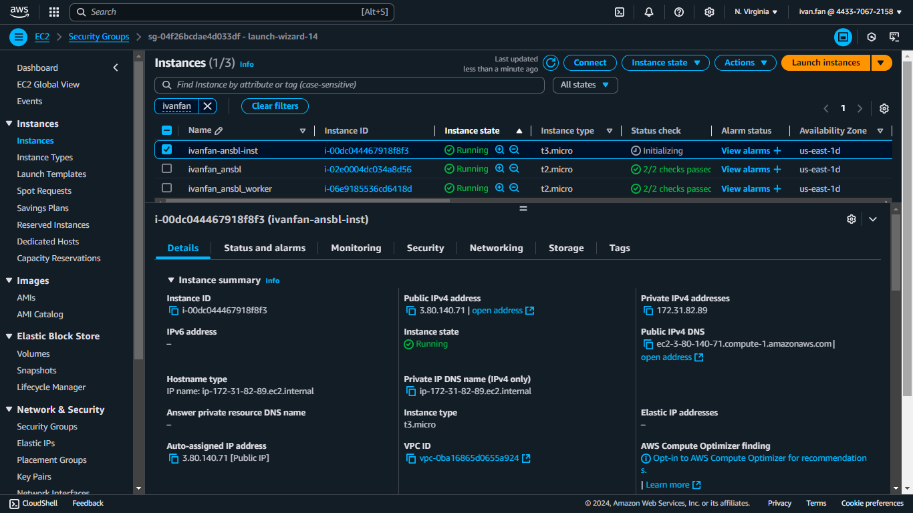

# IBA devops training

## HW17. Ansible. Create and destroy AWS EC2 isntance

#### Copy file to remote host
[ansible_ec2_create.yml](https://github.com/voyager1122/iba_hw17/blob/main/ansible_ec2_create.yml)



```
root@ip-172-31-81-185:/etc/ansible# ansible-playbook ansible_ec2_create.yml

PLAY [Create and configure EC2 instance with Docker] *****************************************************************************************

TASK [Create EC2 isntance] *******************************************************************************************************************
changed: [localhost]

TASK [EC2 instance info] *********************************************************************************************************************
ok: [localhost] => {
    "ec2_instance": {
        "changed": true,
        "failed": false,
        "instance_ids": [
            "i-0beb86c562c08e7db"
        ],
        "instances": [
            {
                "ami_launch_index": 0,
                "architecture": "x86_64",
                "block_device_mappings": [
                    {
                        "device_name": "/dev/sda1",
                        "ebs": {
                            "attach_time": "2024-12-30T13:43:31+00:00",
                            "delete_on_termination": true,
                            "status": "attached",
                            "volume_id": "vol-0cb53f53d9d8988e7"
                        }
                    }
                ],
                "boot_mode": "uefi-preferred",
                "capacity_reservation_specification": {
                    "capacity_reservation_preference": "open"
                },
                "client_token": "0a99453e078f48db8241eeac567da147",
                "cpu_options": {
                    "core_count": 1,
                    "threads_per_core": 2
                },
                "current_instance_boot_mode": "uefi",
                "ebs_optimized": false,
                "ena_support": true,
                "enclave_options": {
                    "enabled": false
                },
                "hibernation_options": {
                    "configured": false
                },
                "hypervisor": "xen",
                "image_id": "ami-0e2c8caa4b6378d8c",
                "instance_id": "i-0beb86c562c08e7db",
                "instance_type": "t3.micro",
                "key_name": "devops",
                "launch_time": "2024-12-30T13:43:30+00:00",
                "maintenance_options": {
                    "auto_recovery": "default"
                },
                "metadata_options": {
                    "http_endpoint": "enabled",
                    "http_protocol_ipv6": "disabled",
                    "http_put_response_hop_limit": 2,
                    "http_tokens": "required",
                    "instance_metadata_tags": "disabled",
                    "state": "applied"
                },
                "monitoring": {
                    "state": "disabled"
                },
                "network_interfaces": [
                    {
                        "association": {
                            "ip_owner_id": "amazon",
                            "public_dns_name": "ec2-52-201-216-164.compute-1.amazonaws.com",
                            "public_ip": "52.201.216.164"
                        },
                        "attachment": {
                            "attach_time": "2024-12-30T13:43:30+00:00",
                            "attachment_id": "eni-attach-0cb05a3d842c116f5",
                            "delete_on_termination": true,
                            "device_index": 0,
                            "network_card_index": 0,
                            "status": "attached"
                        },
                        "description": "",
                        "groups": [
                            {
                                "group_id": "sg-04f26bcdae4d033df",
                                "group_name": "launch-wizard-14"
                            }
                        ],
                        "interface_type": "interface",
                        "ipv6_addresses": [],
                        "mac_address": "12:1f:04:d5:4f:f1",
                        "network_interface_id": "eni-0b41f2b1500357bbe",
                        "owner_id": "443370672158",
                        "private_dns_name": "ip-172-31-88-196.ec2.internal",
                        "private_ip_address": "172.31.88.196",
                        "private_ip_addresses": [
                            {
                                "association": {
                                    "ip_owner_id": "amazon",
                                    "public_dns_name": "ec2-52-201-216-164.compute-1.amazonaws.com",
                                    "public_ip": "52.201.216.164"
                                },
                                "primary": true,
                                "private_dns_name": "ip-172-31-88-196.ec2.internal",
                                "private_ip_address": "172.31.88.196"
                            }
                        ],
                        "source_dest_check": true,
                        "status": "in-use",
                        "subnet_id": "subnet-051774fda132251b3",
                        "vpc_id": "vpc-0ba16865d0655a924"
                    }
                ],
                "placement": {
                    "availability_zone": "us-east-1d",
                    "group_name": "",
                    "tenancy": "default"
                },
                "platform_details": "Linux/UNIX",
                "private_dns_name": "ip-172-31-88-196.ec2.internal",
                "private_dns_name_options": {
                    "enable_resource_name_dns_a_record": false,
                    "enable_resource_name_dns_aaaa_record": false,
                    "hostname_type": "ip-name"
                },
                "private_ip_address": "172.31.88.196",
                "product_codes": [],
                "public_dns_name": "ec2-52-201-216-164.compute-1.amazonaws.com",
                "public_ip_address": "52.201.216.164",
                "root_device_name": "/dev/sda1",
                "root_device_type": "ebs",
                "security_groups": [
                    {
                        "group_id": "sg-04f26bcdae4d033df",
                        "group_name": "launch-wizard-14"
                    }
                ],
                "source_dest_check": true,
                "state": {
                    "code": 16,
                    "name": "running"
                },
                "state_transition_reason": "",
                "subnet_id": "subnet-051774fda132251b3",
                "tags": {
                    "Name": "ivanfan-ansbl-inst"
                },
                "usage_operation": "RunInstances",
                "usage_operation_update_time": "2024-12-30T13:43:30+00:00",
                "virtualization_type": "hvm",
                "vpc_id": "vpc-0ba16865d0655a924"
            }
        ],
        "spec": {
            "BlockDeviceMappings": [],
            "ClientToken": "0a99453e078f48db8241eeac567da147",
            "ImageId": "ami-0e2c8caa4b6378d8c",
            "InstanceType": "t3.micro",
            "KeyName": "devops",
            "MaxCount": 1,
            "MinCount": 1,
            "NetworkInterfaces": [
                {
                    "DeleteOnTermination": true,
                    "DeviceIndex": 0,
                    "Groups": [
                        "sg-04f26bcdae4d033df"
                    ],
                    "SubnetId": "subnet-051774fda132251b3"
                }
            ],
            "TagSpecifications": [
                {
                    "ResourceType": "volume",
                    "Tags": [
                        {
                            "Key": "Name",
                            "Value": "ivanfan-ansbl-inst"
                        }
                    ]
                },
                {
                    "ResourceType": "instance",
                    "Tags": [
                        {
                            "Key": "Name",
                            "Value": "ivanfan-ansbl-inst"
                        }
                    ]
                }
            ]
        }
    }
}

TASK [Wait for SSH to become available on the instance] **************************************************************************************
ok: [localhost]

TASK [Install Docker on the instance] ********************************************************************************************************
[WARNING]: Platform linux on host localhost is using the discovered Python interpreter at /usr/bin/python3.12, but future installation of
another Python interpreter could change the meaning of that path. See https://docs.ansible.com/ansible-
core/2.17/reference_appendices/interpreter_discovery.html for more information.
changed: [localhost -> 52.201.216.164]

TASK [Run Docker container with nginx] *******************************************************************************************************
changed: [localhost -> 52.201.216.164]

TASK [Stop and delete instance] **************************************************************************************************************
changed: [localhost]

PLAY RECAP ***********************************************************************************************************************************
localhost                  : ok=6    changed=4    unreachable=0    failed=0    skipped=0    rescued=0    ignored=0


```
